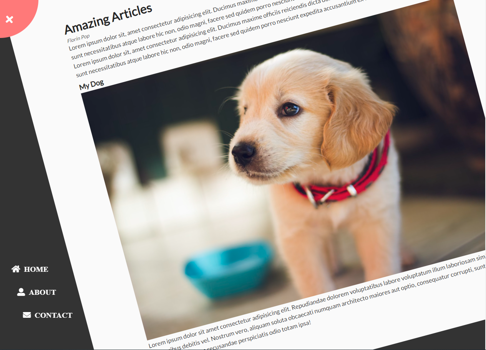

### Rotating navigation
;

- Live view: https://50-project-html-css-js-chatgpt.netlify.app/03-rotating-nav-animation

The given code contains three JavaScript statements that create a responsive navigation menu on a website. Below is the explanation of each statement.

1. `const container = document.querySelector(".container");`

The code selects the HTML element with class "container" using `document.querySelector` and stores it in the `container` constant variable. This represents the container element that encloses the navigation menu.

2. `const open = document.getElementById("open"); const close = document.getElementById("close");`

These two lines of code select the HTML elements with IDs "open" and "close" respectively using `document.getElementById` method and store them into `open` and `close` constant variables. These elements represent the button to open and close the responsive navigation menu.

3. `open.addEventListener("click", () => { ... }); close.addEventListener("click", () => { ... });`

These lines of code add event listeners to the "open" and "close" buttons of the responsive navigation menu respectively.

- When the user clicks on the "open" button, an anonymous Arrow Function is executed.
- It adds the "show-nav" class to the container element, which animates and displays the navigation menu.
- Similarly, when the user clicks on the "close" button, another anonymous Arrow Function is executed.
- It removes the "show-nav" class from the container element, which hides the navigation menu.

In conclusion, the above JavaScript code creates a responsive navigation menu that opens and closes based on the user's action.
